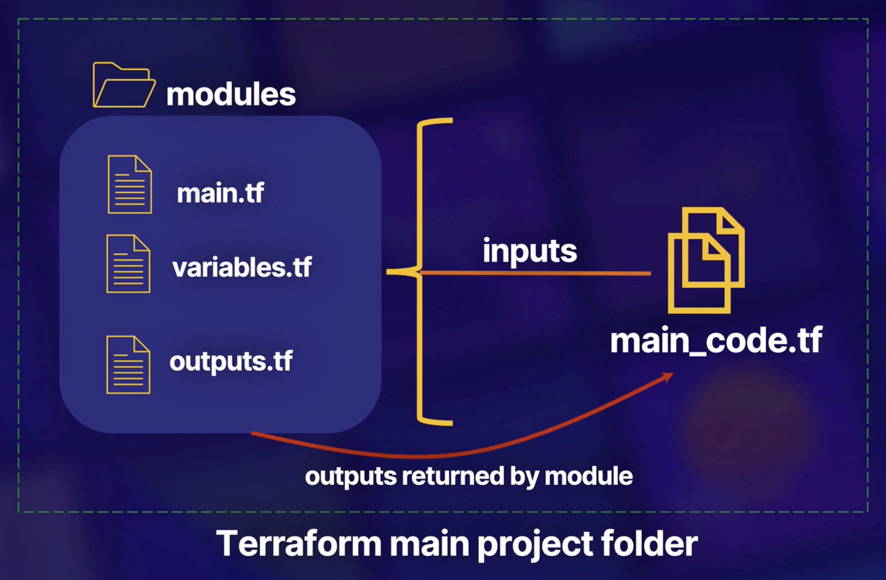

# Terraform Training

## IaC and Its Benefits


## Install Terraform and Terraform Provider

### Install Terraform

#### OS X

```bash
brew tap hashicorp/tap
brew install hashicorp/tap/terraform
brew update
brew upgrade hashicorp/tap/terraform
```

#### Ubuntu Linux

```bash
sudo apt-get update && sudo apt-get install -y gnupg software-properties-common curl
curl -fsSL https://apt.releases.hashicorp.com/gpg | sudo apt-key add -
sudo apt-add-repository "deb [arch=amd64] https://apt.releases.hashicorp.com $(lsb_release -cs) main"
sudo apt-get update && sudo apt-get install terraform
```

### Verify the installation

```bash
terraform -help
```

### Setting AWS configuration

```bash
# Configure  AWS  CLI
aws configure
# Disable the pager for a single command use
aws configure set cli_pager ""
# Lists  the  IAM  users
aws iam list-users
# Lists all managed policies that are attached to the specified IAM user
aws iam list-attached-user-policies --user-name {your_aws_user_name}
```

- To create policies that control the access to AWS, use [AWS Policy Generator](https://awspolicygen.s3.amazonaws.com/policygen.html)

### Terraform Providers

- Provider are Terraform's way of **abstracting** integrations with **API control layer** of the infratstructure vendors
- **Terraform Providers registry**\
  <https://registry.terraform.io/browse/providers>
  - Example: [AWS Provider](https://registry.terraform.io/providers/hashicorp/aws/latest), [AWS Provider Document](https://registry.terraform.io/providers/hashicorp/aws/latest/docs)

- Providers are **plugins**.
- You can write your own custom providers as well.

---

## Naming Conventions

### General conventions

- Use `_` (underscore) instead of `-` (dash) in all: resource names, data source names, variable names, outputs.
- Only use lowercase letters and numbers.

### Resource and data source arguments

- Resource and data source arguments
  - Good: `resource "aws_route_table" "public" {}`
  - Bad: `resource "aws_route_table" "public_route_table" {}`
  - Bad: `resource "aws_route_table" "public_aws_route_table" {}`
- Resource name should be named `this` / `main` if there is no more descriptive and general name available, or if resource module creates single resource of this type (eg, there is single resource of type `aws_nat_gateway` and multiple resources of type `aws_route_table`, so `aws_nat_gateway` should be named `this` / `main` and `aws_route_table` should have more descriptive names - like `private`, `public`, `database`).
- Naming Convention for AWS Resources:\
  `${Product}_${Environment}_${ComponentType}_${ServiceName}_${ServiceComponent}_${ComponentReference}`\
  A Lambda function would then have a Name like the following:\
  - `ProductA_Stag_Lambda_Integration_Requeue_C140`
  - `ProductA_Prod_IAMRole_Integration_C141`
  - `ProductA_Prod_EC2_Web_Master_C142`
- Always use singular nouns for names.
- Use `-` inside arguments values and in places where value will be exposed to a human (eg, inside DNS name of RDS instance).
- [More...](https://www.terraform-best-practices.com/naming)

---

## Key Concept

### Workflow

- `Write → Plan → Apply`

  

  - `Write`: Create code.
  - `Plan`: Review change / Does not deploy. \
  In this state authentication credentials are used to connect your infrastructre if required.
  - `Apply`: Provision real infrastructure.\
  Update the deployment state tracking mechanism file (state file).
  - `Destroy`: Destroys all resources created by code.\
  Non-reversible command. Take backup, and be sure that you want to delete infrastructure.

### State

- Its map real world resource to Terraform configuration
- Resource tracking: A way for Terraform to keep tabs on what has been deployed
- `terraform.tfstate`: A JSON dump containing all the metadata about your Terraform deployment. Stored locally in the same directory where Terraform code resides.
- For better integrity and availability `terraform.tfstate` can also be stored remotely. Allow sharing state between distributed team via AWS S3, GCP Storage.
  - Remote state allows locking so parrallel executions dont coincide

    
  - Enable sharing "output" values with other Terraform configuration or code

    
- Because the state file is so critical to Terraform's functionality so:
  - **Never lose it**
  - **Never let it into wrong hands even**
- Scenario use Terraform state command:
  - Advanced state management
  - Manually remove a resource from Terraform State file so that it not managed by Terraform\
    `terraform state rm`
  - Listing out tracked resource\
    `terrform state list`
  - Show the details resources\
    `terraform state show`


### Resource Addressing

- Configuring the Provider

  ```terraform
  provider "aws" {
    region = "us-east-1"

  }

  provider "google" {
    credentials = file("credentials.json")
    project     = "my-gcp-project"
    region      = "us-west-1"
  }
  ```

  `provider`: Reversed keyword\
  `"aws"`: Provider name\
  `region = "us-east-1"`: Configuration parameters\
  `file`: Built-in function

- Resource Block

  ```terraform
  resource "aws_instance" "web" {
    ami           = "ami-a1b2c3d4"
    instance_type = "t2.micro"
  }
  ```

  `resource`: Reserved keyword\
  `"aws_instance"`: Resource provided by the Terraform provider\
  `"web"`: User-provided arbitrary resource name\
  `ami = "ami-a1b2c3d4"`: Resource config parameter

- Data Resource Block

  ```terraform
  data "aws_instance" "my-vm" {
    instance_id = "i-1234567890abcdef0"
  }
  ```

  Each provider may offer data sources alongside its set of resource types.\
  `data`: Reversed keyword\
  `"aws_instance"`: Resource provided by Terraform provider\
  `"my-vm"`: User-provided arbitrary resource name\
  `instance_id = "i-1234567890abcdef0"`

- Resource Address

  `aws_instance.web`: Resource address\
  `data.aws_instance.my-vm"`: my-vm

### Variables and Outputs

- Variables

  ```terraform
  variable "my-var" {
    description = "My Test Variable"
    type        = string
    default     = "Hello"
    sensitive   = false
  }
  ```

  `variable`: Reversed keyword\
  `"my-var"`: User-provided variable name\
  `description/type/default/sensitive`: Variable config arguments\
  Referencing a variable: `var.my-var`

- Validation Feature (Optional)

  ```terraform
  variable "my-var" {
    description = "My Test Variable"
    type        = string
    default     = "Hello"
    validation {
      condition     = length(var.my-var) > 4
      error_message = "The string must be more than 4 characters"
    }
  }
  ```

- Types
  - Basic Types:
    - string
    - number
    - bool
  - Complex Types:
    - list, set, map, object tuple

      ```terraform
      variable "availibility_zone_names" {
        type        = list(string)
        default     = ["us-west-1a"]
      }
      variable "docker_ports" {
        type    = list(object({
          internal = number
          external = number
          protocol = string
        }))
        default = [
          {
            internal = 8080
            external = 8081
            protocol = "tcp"
          }
        ]
      }
      ```

- Output

  ```terraform
  output "instance_ip" {
    description = "VM's Private IP"
    value = aws_instance.my-vm.private_ip
  }
  ```

  `output`: Reversed keyword\
  `"instance_ip"`: User-provided variable name\
  Output variable values are shown on the shell after running `terraform apply`

### Terraform Provisioners

- Terraform way of bootstrap custom scripts, commands or actions
- Can be run either locally or remotely on resource spun up through Terraform deployment
- Each individual resource can have its own "provisioner" defining the connection method (SSH/WinRM) and the actions/commands or scripts to excute
- 2 types of provisioners (run once)
  - Creation-time
  - Destroy-time

#### Best Practices and Cautions

- HashiCorp recommends to use them sparingly, and only when the underlying vendors, such as AWS does not already provide a built in mechanism for bootstrapping via custom commands or scripts.
  - For example: AWS allows for passing scripts through user data in EC2 virtual machines. So if there's a better inherently available method for a resource, Hashicorp recommends using that.
- An important thing to note is that, since provisioners can take any independent action through a script or command. Terraform cannot and does not track them, as they break Terraform's declarative model.
- If the command within a provisioner return non-zero code, it's considered failed and underlying resource is tainted.
  - Marks the resource against which the provisioner was to be run to be created again on the next run.

  ```terraform
  resource "null_resource" "dummy_resource" {
    provisioner "local-exec" {
      command = "echo '0' > status.txt"
    }
    provisioner "local-exec" {
      when    = destroy
      command = "echo '1' > status.txt"
    }
  }
  ```

- By default, the provisioner is a create provisioner.
- `terraform apply --auto-approve`
- Variable usage behavior inside provisioner\
  `self.id = aws_instance.ec2-virtual-machine.id`

  ```terraform
  resource "aws_instance" "ec2-virtual-machine" {
    ami = ami-12345
    instance_type = t2.micro
    key_name = aws_key_pair.master-key.key_name
    ...
    provisioner "local-exec" {
      command = "aws ec2 wait instance-status-ok --region us-east-1 --instance-ids ${self.id}"
    }
  }
  ```

---

## Terraform Modules

### Accessing and Using Terraform Modules



- Terraform module is a container for multiple resources that are used together
  - Make code reusable.
- Directory hold main Terraform code is called the `root` module.
  - If you never work with modules before. Definitely always worked inside the root module.
  - If you invoke other modules inside your code. Newly referenced modules are known as child modules.
- Modules can be downloaded or referenced from
  - Terraform Public/Private/Local Registry
- Module are referenced using `module` block

  ```terraform
  module "my-vpc-module" {
    source  = "./module/vpc"
    version = "0.0.5"
    region  = var.region
  }
  ```

  `module`: Reversed keyword\
  `"my-vpc-module"`: Module name\
  `source`: Module source\
  `version`: Module version\
  `region`: Input parameters
  - Other allowed parameters: `count`, `for_each`, `provider`, `depends_on`

- Module can take optionally take input and provide outputs to pluck back main code.

  ```terraform
  resource "aws_instance" "vpc-module" {
    ... # Other arguments
    subnet_id = module.my-vpc-module.subnet-id
  }
  ```

---

## Built-in Function and Dynamic Blocks

### Terraform Built-in Functions

- Help you transform and combine values. Making code dynamic and flexible.
- User-defined function is not allowed -- Only built-in ones
- General syntax: function_name(arg1, arg2, ...)

  ```terraform
  variable "project-name" {
    type    = string
    default = "prod"
  }

  resource "aws_vpc" "my-vpc" {
    cidr_block = "10.0.0.0/16"
    tags = {
      Name = join("-", ["terraform", var.project-name])
    }
  }
  ```

  `join`: Function result = `terraform-prod`

- Useful functions can be found [here](https://www.terraform.io/docs/language/functions/index.html)
- For testing function, use interactive console for evaluating:

  ````bash
  terraform console
  ````

### Terraform Type Constraints (Collections & Structural)

- Primitive Type
  - number
  - string
  - blool
- Complex Type
  - list
  - tuple
  - map
  - object
- Collections Type
  - Allow multi values of one primitive type to be grouped together
  - Constructor for these Collections include:
    - list(type)
    - map(type)
    - set(type)

      ```terraform
      variable "training" {
        type    = list(string)
        default = ["ACG", "LA"]
      }
      ```

      - Variable will be `list` of several `string`
      - Two seperate `strings` in one variable

- Structural Type
  - Allow multi values of different primitive type to be grouped together
  - Constructor for these Structural include:
    - object(type)
    - tuple(type)
    - set(type)

      ```terraform
      variable "instructor" {
        type = object({
          name = string
          age  = number
        })
      }
      ```

      - Primitive types is serveral named attributes
      - Object type contain several variables within it

- Dynamic Type - The `any` constraint
  - `any` is a placeholder for a primitive type yet to be decided
  - Allow us more flexiblility

  ```terraform
  variable "data" {
    type = list(any)
    default = [1, 42, 7]
  }
  ```

  - Terraform recognizes all values as number in one variable

### Terraform Dynamic Blocks

- What
  - Dynamically constructs repeatable nested configuration block inside Terraform resource
  - Support within the following block types
    - resource
    - data
    - provider
    - provisioner
- Why
  - Make your code block look cleaner
    - Normal snippet of Terraform without dynamic block

      ```terraform
      resource "aws_security_group" "my-sg" {
        name   = 'my-aws-security-group'
        vpc_id = aws_vpc.my-vpc.id
        ingress {
          from_port  = 22
          to_port    = 22
          protocol   = "tcp"
          cidr_block = ["1.2.3.4/32"]
        }
        ingress {
          ... # More ingress rules
        }
      }
      ```

    - Using dynamic block

      ```terraform
      variable "rules" {
        default = [
          {
            port  = 80
            proto = "tcp"
            cidr_blocks = ["0.0.0.0/0"]
          },
          {
            port  = 22
            proto = "tcp"
            cidr_blocks = ["1.2.3.4/32"]
          }
        ]
      }

      resource "aws_security_group" "my-sg" {
        name = 'my-aws-security-group'
        vpc_id = aws_vpc.my-vpc.id
        dynamic "ingress" {
          for_each = var.rules
          content {
            from_port = ingress.value["port"]
            to_port = ingress.value["port"]
            protocol = ingress.value["proto"]
            cidr_block = ingress.value["cidrs"]
          }
        }
      }
      ```

      `dynamic "ingress"` is the config block you're trying to replicate\
      Nested `content` block defines the body of each generated block, using the variable you provided
- How
  - Dynamic block expect a complex variable type to iterate over
  - For loop and outputs a nested block for each element in your variable
- Caution
  - Can be make code hard to read and maintain
  - Only use dynamic block when you need to hide detail in order to build a cleaner user interface when writing reusable modules

---

## Terraform CLI

### Terraform fmt, taint, and import Commands

#### Terraform fmt (format)

- What
  - Format Terraform code for readability
  - Helps in keeping code consistent
  - Safe to run at any time
- When
  - Before pushing code to git
  - After upgrade Terraform or it modules
  - Anytime you make change the codes
- How

  ```bash
  terraform fmt
  ```

#### Terraform taint

- What
  - Taints a resource, forcing it to be destroyed and recreated
  - Modifier state file, which causes the recreation workflow
  - Tainting a resource may cause other resources to be modified
- When
  - To cause provision to run
  - Replace misbehaving resources forcefully
  - To mimic side effects of recreation not modeled by any attributes of the resources
- How

  ```bash
  terraform taint {resource_address}
  ```

#### Terraform import

- What
  - Map existing resource to Terraform using `"ID"`
  - `"ID"` is dependent on the underlying vendor, for example to import an AWS EC2 instance you 'll need to provide its instance ID
  - Import same resource to multiple Terraform resources can cause unknow behavior and its is not recommended
- When
  - Work with existing resource
  - Not allowed create new resource
  - Not in control of creation process of infrastructure
- How

  ```bash
  terraform import {resource_address} {ID}
  ```

#### Terraform Configuration Block

- What
  - A special configuration block for controlling Terraform own behavior
  - This block only allows constant values, named resources and variables are not allowed in it.
- When
  - Configuring backend for storing state files
  - Specify Terraform version
  - Specify Terraform provider version
  - Enable and test Terraform experimental features
  - Passing metadate to provider
- How

  ```bash
  terraform {
    required_version = ">=0.13.0"
    required_providers {
      aws = ">=3.0.0"
    }
  }
  ```

### Terraform Workspace

#### CLI

- What
  - Terraform Workspaces are alternate state files within same directory
    - Eeach workspace tracks a seperate independent copy of the state file
  - Terraform starts with a single workspace that is always called `default`. It cannot be deleted
  - Commands
    | Workspace command                             | Use              |
    | --------------------------------------------- | ---------------- |
    | `terraform workspace list`                    | List workspace   |
    | `terraform workspace new <WORKSPACE-NAME>`    | Create workspace |
    | `terraform workspace select <WORKSPACE-NAME>` | Select workspace |
  - Access to Workspace name is provided through the `${terraform.workspace}` variable
- When
  - Test changes using parallel, distinct copy of infrastructure to diffrent environment
  - It can be modeled againts branches in version control such as Git
#### Workspace Example

  ```text
           Terraform Controller node

                       ↓

            ${terraform.workspace}

  (developer) ↓                ↓ (default)

       Developer Test         Default Production
       Infrastructure           Infrastructure
        Environment              Environment
  ```

- Example 1

  ```terraform
  resource "aws_instance" "example" {
    count = terraform.workspace == "default" ? 5 : 1
    # ... other arguments
  }
  ```

- Example 2

  ```terraform
  resource "aws_s3_bucket" "bucket" {
    bucket = "myxyzbucket-${terraform.workspace}"
    acl    = private
  }
  ```

- Note
  - `terraform.tfstate`: Default state file maintaince by the default workspace
  - `terraform.d.tfstate`: Any Workspace state files are stored inside this file

### Debugging Terrform

#### TF_LOG and TF_LOG_PATH

- `TF_LOG` is an environment variable for enabling verbose logging in Terraform. By default it will send logs to `stderr` (standard error output).
- Can be set to the following levels: `TRACE`, `DEBUG`, `INFO`, `WARN`, `ERROR`
- `TRACE` is most verbose level of logging and most reliable one
- To persist logged output, use `TF_LOG_PATH` environment variable
- Setting logging environment varibales for Terraform *Nix

  ```bash
  export TF_LOG=TRACE
  export TF_LOG_PATH=./terraform.log
  ```
